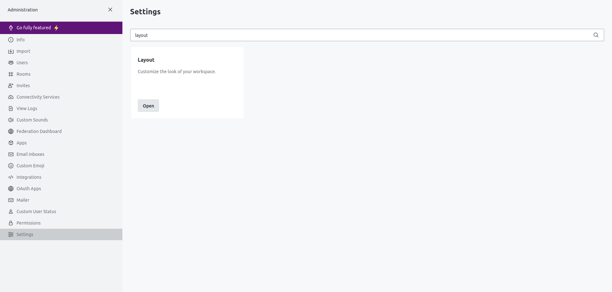

# RocketTags by Grzojda

## Main goal
Main goal of this project is to add tag mention to RocketChat. I'm advanced Discord user, and tag mentions, are one of the things I miss the most from Discord.

## What it adds
1. Create and sync tags' configuration
2. Mention created tags

## Requirements
1. Admin privileges to RocketChat 

## How to use
1. You have to copy whole script.js content
2. Go to Your RocketChat's admin panel (should be sth like https://rocketchat.example/admin/info)
3. Scroll down on the left panel and click on Settings
4. Search for Layout -> Open
5. Now click on Custom Scripts
6. Scroll down to *Custom Script for Logged In Users* section and paste code copied in step 1.
7. Save changes on right upper corner
8. Go to any channel(or dm) and type `grzojda_rocketTags_configurator` and click Enter
9. RocketTag's configurator should load
10. Configure by adding as many tags as You want, and drag and dropping users to tag's containers
11. Now click *Export config file* button - file should be downloaded
12. Send file downloaded in step 11. to any conversation(You can dm it to Yourself)
13. Copy file url(right mouse button -> copy link)
14. Remove `?download` from copied url
15. Go back to *Custom Script* section in admin panel
16. Replace `YOUR_CONFIGURATION_URL` by copied url
17. Enjoy!

## To be implemented / Fixed
1. If there are 2 tags `test` and `test2`, and we mention `@test2` then it's replaced to `@user 2`. We have to change replaceAll with some regex magic that will prevent it to happen.
2. Update configuration once per day. Right now local config is always overwritten.
3. In newer version of rocket-chat messages are inside div elements. For these versions this script for now doesn't work.