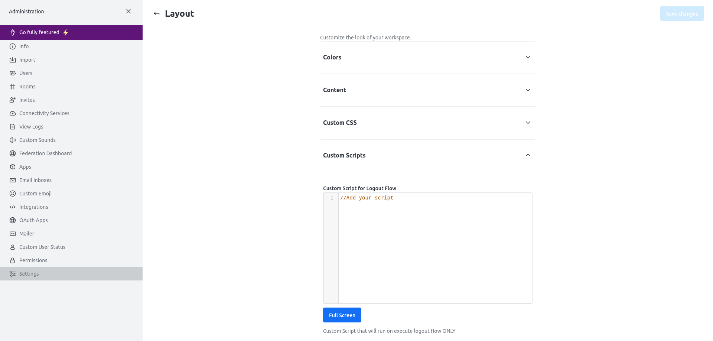
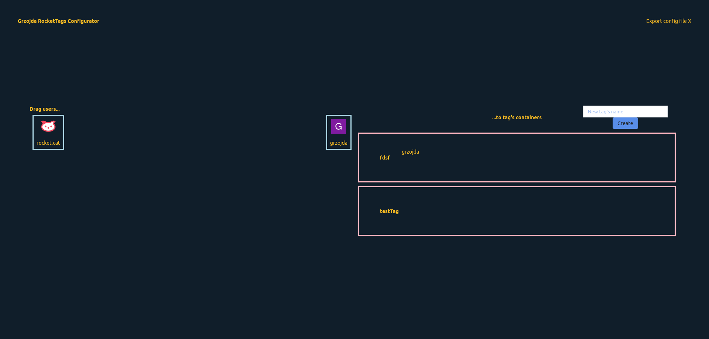

# RocketTags by Grzojda

## Main goal
Main goal of this project is to add tag mention to RocketChat. I'm advanced Discord user, and tag mentions, are one of the things I miss the most when using rc.

## What it adds
1. Create and sync tags' configuration
2. Mention created tags

## Requirements
1. Admin privileges to RocketChat

## "Installation"
1. Copy whole script.js content
2. You can change 4 thing - configuration editors (**it's important one**), configuration channel, and configuration sync interval and configurator start command. Anyway the only thing you **HAVE TO CHANGE** is configuration editors array(as long as Your username is not admin). Otherwise, You won't be able to configure this plugin.
3. Paste it in *Custom Script for Logged In Users* in Layout settings 
4. Voi la!

## Configuration
1. You or one of the co-workes, which You added to the very important array we talked about in [Installation](#-installation-), can now start tag configuration
2. To do so, You have to type in message box configurator command (by default `grzojda_rocketTags_configurator`) and click Enter
3. 🪄 Welcome to the configuration center  (i know it ain't pretty)
4. Now, You can easily create new tags and (by drag and drop) assign users to them
5. When You finish don't forget to click that Export "button", otherwise You're going to lose Your work

## User guide
1. After configuration comes best part. Using!
2. So if You type '@' in message box, in pop-up You should see tags that can be used
3. Click with mouse or select with arrows and click enter
4. Send Your message
5. If You find any bugs, let me know I will fix 'em when I will get another productivity kick ;)

## To be implemented / Fixed
1. Add simple version control
2. Check if everything works with threads
3. Better styling